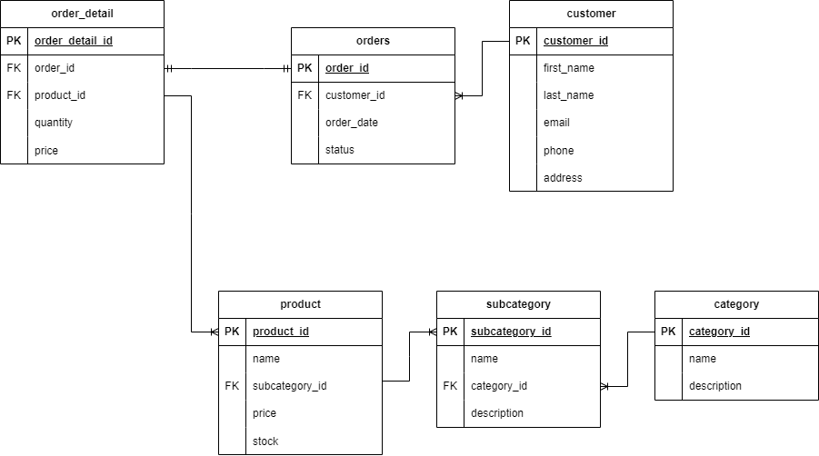
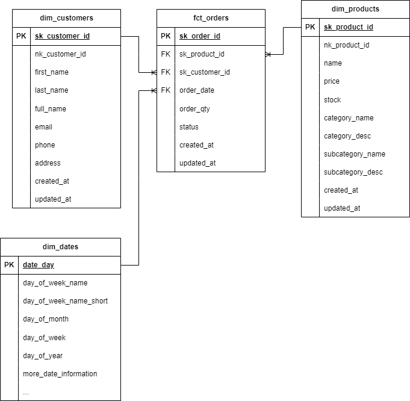

# **Mini Order dbt**
---

- Untuk data Mini Order, bisa merujuk ke repository berikut https://github.com/ihdarsyd/mini-order/
- Untuk menjalankan data Mini Order, masukkan command `docker compose up -d`

### **Mini Order Schema**
---

### **Data Warehouse**
---
- Pada case ini, kita akan membuat Data Warehouse & Mart dengan menggunakan tools dbt
- Data model yang digunakan pada case ini adalah Kimball Star Schema
- Karena menggunakan dbt, maka akan dibagi menjadi dua layers:
    - `Staging Layers`: digunakan untuk menyimpan seluruh table yang di extract dari source dan minim transform
    - `Mart Layers`: digunakan untuk menyimpan table yang sudah diimplementasikan Star Schema Data Modeling

- Dengan menggunakan Star Schema, maka table yang dihasilkan adalah:
    - `dim_customers`
    - `dim_products`
    - `dim_dates`
    - `fct_orders`

- Untuk schema dari Data Warehouse adalah sebagai berikut

### **How to Run this Repo**
---
1. Install dbt, `pip install dbt-postgres`
2. Config koneksi sesuai dengan data source
3. Run `dbt debug` untuk mengecek koneksi dengan data source
4. Run `dbt deps` untuk menginstall dependensi yang dibutuhkan
5. Run `dbt run` untuk menjalankan proses transformasi dengan menggunakan dbt

### **Tools**
---

- dbt
- Postgres
- DBeaver
- Docker 